# Importing Scraped Data into Pearltrees: A Step-by-Step Tutorial

This tutorial will guide you through the process of scraping data from websites, exporting it to a compatible format, and importing it into Pearltrees. By following these steps, you'll be able to efficiently organize and manage large amounts of web content in your Pearltrees account.

#### Prerequisites
- Python installed on your system
- Access to a command-line interface
- A Pearltrees account

Pearltrees is a visual and collaborative curation tool that allows you to organize, explore, and share digital content.

#### This tutorial uses two Python scripts:
- pt_clip.py: for scraping URLs from the clipboard
- export_favs.py: for exporting the scraped data to Netscape Bookmark Format

Ensure both scripts are in your working directory or Python path before beginning.

#### Setup
1. Ensure Python is installed on your system. (You can download it from python.org, [WinPython](https://winpython.github.io/) or [Download Anaconda Distribution | Anaconda](https://www.anaconda.com/download/));  if needed there are .bat files in this repo to aid the WinPython approach.
2. Download the required scripts (pt_clip.py and export_favs.py) from the GitHub repository mentioned in Note 2.
3. Either:
	a. Place these scripts in your working directory or 
	b. add their location to your Python path or 
	c. place the .bat file [Desktop_Cmd.bat](https://github.com/s243a/PT_Tools/blob/main/PT_Tools/Desktop_Cmd.bat) in the same directory as these scripts.
**Note 1** the "Desktop_Cmd.bat" approach is recommended for more advanced users and will be discussed in another tutorial. This bat file facilitates easier command-line access (see Note 3 at the bottom of this document).

**Note 2**: The Python scripts ([pt_clip.py](https://github.com/s243a/PT_Tools/blob/main/PT_Tools/pt_clip.py) and [export_favs.py]([PT_Tools/PT_Tools/export_favs.py at main · s243a/PT_Tools (github.com)](https://github.com/s243a/PT_Tools/blob/main/PT_Tools/export_favs.py))) are available on GitHub at: https://github.com/s243a/PT_Tools/tree/main/PT_Tools. You can download them by clicking on the links and then clicking the "Raw" button, then saving the page as a .py file. 

**Note 3** The optional .bat file (i.e. "[Desktop_Cmd.bat](https://github.com/s243a/PT_Tools/blob/main/PT_Tools/Desktop_Cmd.bat)"), will open a terminal, with the working directory the same as where the .bat file is located and will set the path for the python interpreter. This avoids the need to set the location of the python interpreter in an environmental variable, and consequently may add to system security. This .bat file will be discussed in another tutorial. 

# Step. 1 Scrape the data using, "pt_clip.py"

"pt_clip.py" is a Python script that works by reading URLs from the clipboard, and creating a ".url file" for each URL in the copied data (".url files" are Microsoft Windows shortcut files that contain internet addresses.). The URL files are placed in a subfolder within the favorites folder. For instance, we might want to copy the Categories, within the Wikipedia page (Version Control Systems)
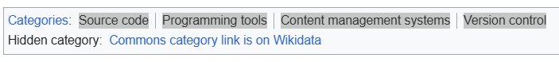
1.**a**. Highlight the URLs you want to copy on the Wikipedia page, right click and select copy.
1.**b**. Open a shell w/ both python and pt_clip.py locatable for execution (See the above setup section)
1.**c**. Run the following command:
`python pt_clip.py

After the above steps, the copied links will appear in the favorites folder:

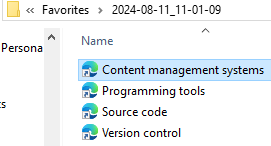

# Step 2. Export the favorites data to a file in Netscape Bookmarks format:

Assuming the data was scraped, via the method in (step #1), the bookmarks can be exported into, "Netscape Bookmark Format", via the command export_favs.py. If the terminal is still open from step #1 you can do this with the following command:
` python export_favs.py

Currently, the export location is hardcoded , but future versions will base the path on the current user and allow for custom modifications. In this example the Bookmarks file is exported to 2024-08-11_11-11-30.html, as shown below:
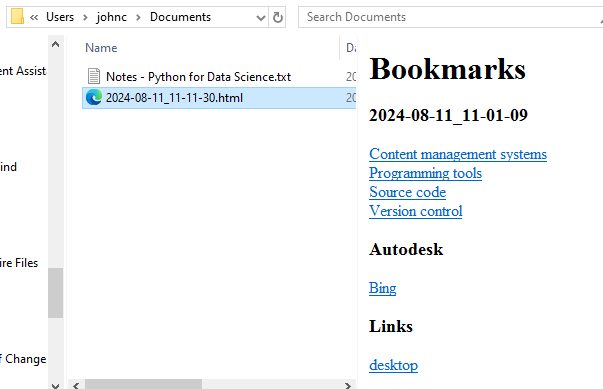

# Step 3. Import the scraped data into Pearltrees.com

The Netscape bookmarks file created in Step #2, can be imported into Pearltrees. Using this technique we can import multiple bookmarks at once into Pearltrees. The steps are as follows:

3.**a**. Navigate to the Pearltrees page where you want the bookmarks to be inserted.
3.**b**. Click the plus button on the Pearltrees user interface.

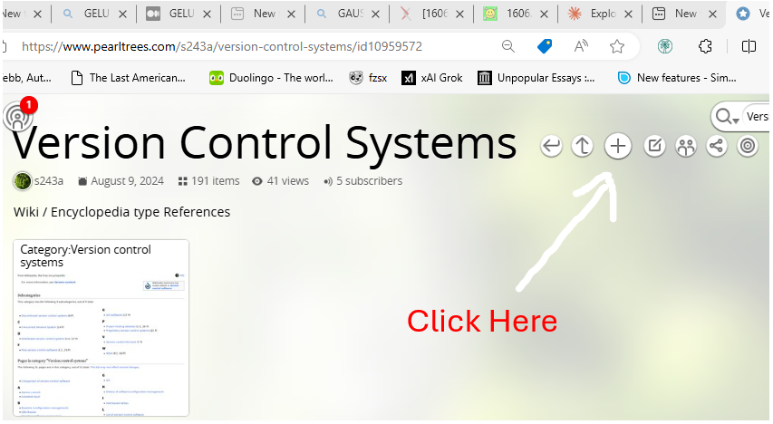
3.**c**. **Select the import tab:**

  \
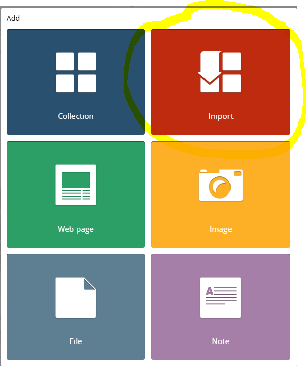

3.**d**. **Select, "My Bookmarks":**
  \
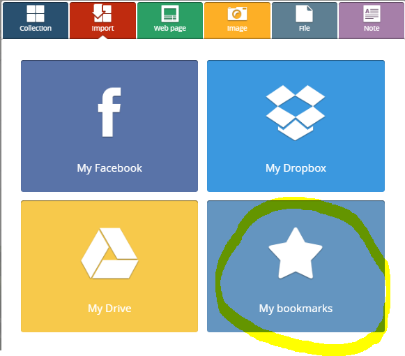
3.**e**. Click on the square that says, "chrome".

  \
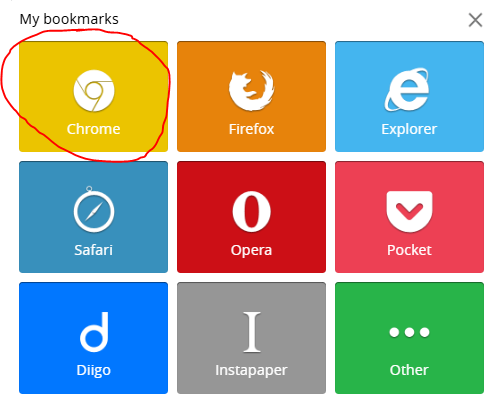
3.**f**. Select upload.

  \
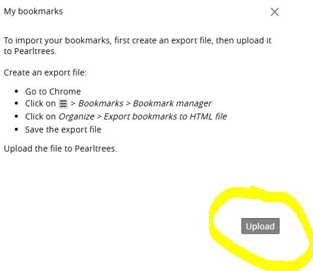

3.**g**. Navigate to the folder containing the, "Netscape bookmark file"(e.g 2024-08-11_11-11-30.html), click on it to select and click open. Alternatively, double clicking the file may negate the need to click the open button. 

3.**h.** Now Pearltrees, will open a window to let you choose which items from the selected folder that you want to import. 

3.**i**. Hover the mouse over the folder/s or bookmark/s you want to select for importing and then click the plus sign in the blue circle to select the item to be imported. 

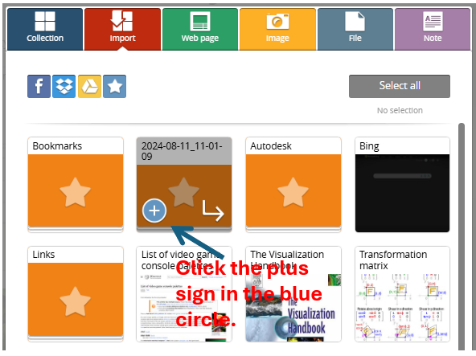

3.**j**. You can also navigate inside a folder if you don't want to select the whole folder to be imported by clicking on the arrow, that goes down and then points to the right.

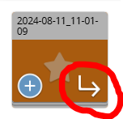

3.**k**. Repeat step "j" to select any additional folder or bookmarks you want to import.

3.**l**. Click the "add" button to import them into Pearltrees. 

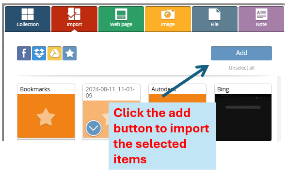
  
3.**m**. Move the imported folder to the desired location on the Pearltrees page:
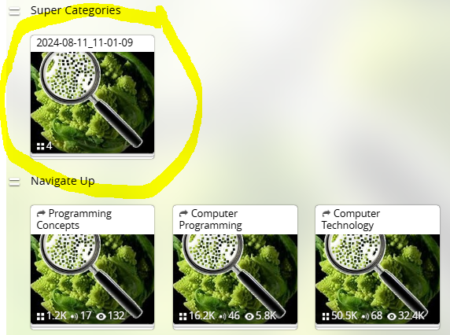
# 4. Optionally, convert the folder into a section

4.**a**. Click on the folder to navigate inside it:
4.**b**. Click on the square shaped edit button.

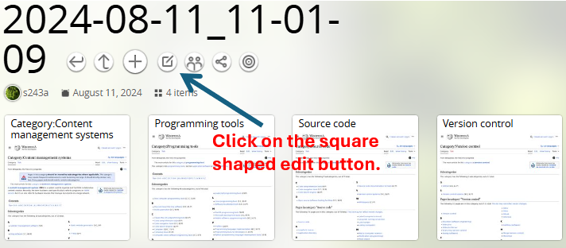

Click on the button that says, "Change to section"

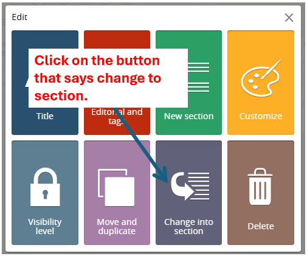

After deleting any unwanted sections and editing section headings we are left with the final result. 
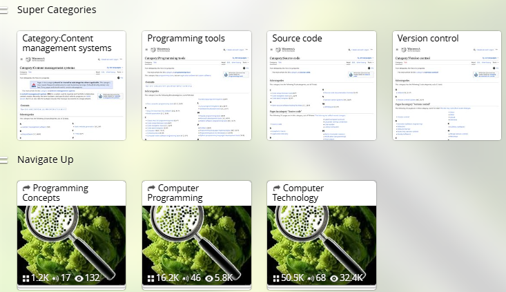
  \
The page in the above example can be found here:
https://www.pearltrees.com/s243a/version-control-systems/id10959572 

# Troubleshooting

- If pt_clip.py or export_favs.py fail to run, ensure Python is correctly installed and added to your system's (or local) PATH environmental variable.
- If the Netscape bookmarks file doesn't appear in Pearltrees' import window, make sure you've selected the correct file format (HTML).
- If you encounter issues with large numbers of bookmarks, try importing them in smaller batches.

# Future Developments

For information about planned features, customization options, and upcoming improvements to these tools, please check the roadmap in our GitHub repository:
[https://github.com/s243a/PT_Tools](https://github.com/s243a/PT_Tools)

We welcome contributions and suggestions from the community to enhance these tools further. The roadmap will be regularly updated to reflect our current development plans and community feedback.

# Conclusion  
  
This method allows you to efficiently scrape, organize, and import large amounts of web content into Pearltrees. By using the provided Python scripts and following these steps, you can quickly build a structured collection of bookmarks in your Pearltrees account. This can be particularly useful for research, content curation, managing resources for various projects and building knowledge bases.

Tutorial Version: 0.1
Tutorial last updated 11-Aug-24